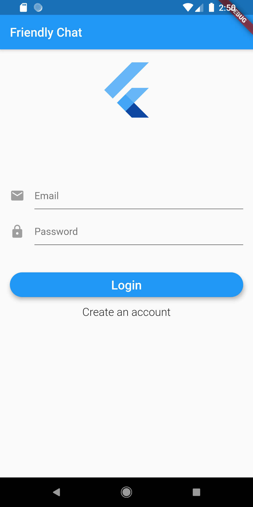
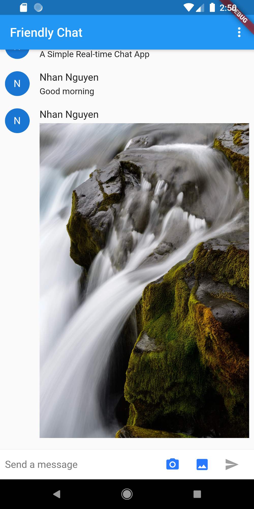

# Friendly Chat

A new Flutter real-time messaging application.

 

Here is an article that can help you build this application on your own: https://medium.com/@ngtrnhan1205/flutter-friendly-chat-app-a-simple-real-time-chat-app-c6519a604681

## Getting Started

This project is a starting point for a Flutter application. Here is an article that can help you build this application on your own: https://medium.com/@ngtrnhan1205/flutter-friendly-chat-app-a-simple-real-time-chat-app-c6519a604681

A few resources to get you started if this is your first Flutter project:

- [Lab: Write your first Flutter app](https://flutter.io/docs/get-started/codelab)
- [Cookbook: Useful Flutter samples](https://flutter.io/docs/cookbook)

For help getting started with Flutter, view 
[online documentation](https://flutter.io/docs), which offers tutorials, 
samples, guidance on mobile development, and a full API reference.
